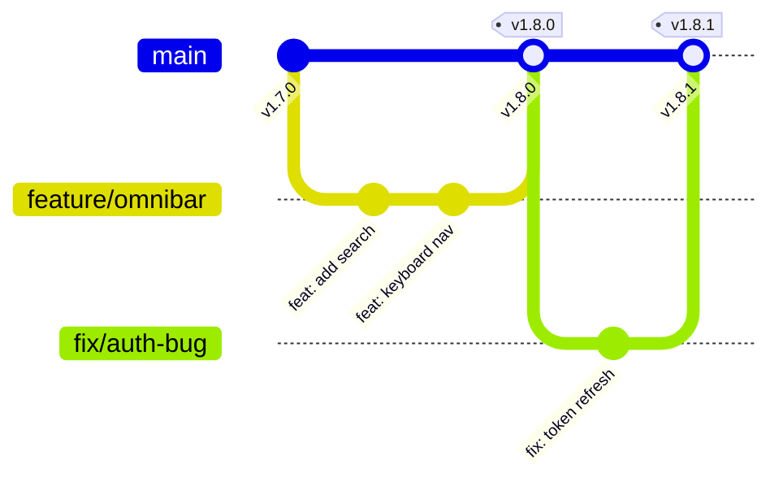

# 🗺️ FlowNote Master Roadmap v2

> **Oluşturulma:** 17 Aralık 2024  
> **Mevcut Versiyon:** v1.8.0  
> **Ödev Odağı:** Feature Branch + Release Train (Conventional Commits + Changelog)

---

## 📊 Genel Bakış

```
┌─────────────────────────────────────────────────────────────────────────────┐
│                         FLOWNOTE ROADMAP OVERVIEW                           │
├─────────────────────────────────────────────────────────────────────────────┤
│                                                                             │
│   PHASE 1          PHASE 2           PHASE 3           PHASE 4             │
│   Ödev Odağı       Kalite            Performans        Özellik             │
│   (1 hafta)        (1 hafta)         (1 hafta)         (2 hafta)           │
│                                                                             │
│   ┌─────────┐      ┌─────────┐       ┌─────────┐       ┌─────────┐         │
│   │ DevOps  │ ──▶  │  Test   │  ──▶  │  Perf   │  ──▶  │   AI    │         │
│   │  Docs   │      │Coverage │       │  Cache  │       │ Omnibar │         │
│   └─────────┘      └─────────┘       └─────────┘       └─────────┘         │
│                                                                             │
│   v1.8.1-1.8.3     v1.9.0            v1.10.0           v2.0.0              │
│                                                                             │
└─────────────────────────────────────────────────────────────────────────────┘
```

---

## 🎯 PHASE 1: DevOps Excellence (Ödev Odağı)

> **Süre:** 3-5 gün  
> **Hedef:** Ödev konusunu mükemmelleştir, dokümantasyonu zenginleştir  
> **Versiyonlar:** v1.8.1 → v1.8.3

### Sprint 9A: DevOps Documentation

| # | Görev | Öncelik | Süre | Çıktı |
|---|-------|---------|------|-------|
| 1 | **ADR-003: Release Strategy** | P0 | 2 saat | `.ai-context/ADR/ADR-003-release-strategy.md` |
| 2 | **CONTRIBUTING.md** | P0 | 2 saat | `CONTRIBUTING.md` |
| 3 | **PR Template** | P1 | 30 dk | `.github/pull_request_template.md` |
| 4 | **Issue Templates** | P1 | 30 dk | `.github/ISSUE_TEMPLATE/` |
| 5 | **README DevOps Section** | P0 | 1 saat | README.md güncelleme |
| 6 | **Git Flow Diagram** | P1 | 1 saat | Mermaid diagram |

### 📄 ADR-003 İçeriği (Ödev için kritik)

```markdown
# ADR-003: Release Strategy & Semantic Versioning

## Durum
Kabul Edildi (Aralık 2024)

## Bağlam
FlowNote projesi için tutarlı ve otomatik bir sürümleme stratejisi gerekiyor.

## Karar

### 1. Semantic Versioning (SemVer)
- MAJOR.MINOR.PATCH formatı
- feat: → MINOR (1.x.0)
- fix: → PATCH (1.0.x)  
- BREAKING CHANGE → MAJOR (x.0.0)

### 2. Conventional Commits
| Tip | Açıklama | Release |
|-----|----------|---------|
| feat | Yeni özellik | minor |
| fix | Bug düzeltme | patch |
| perf | Performans | patch |
| refactor | Kod düzenleme | patch |
| docs | Dokümantasyon | - |
| test | Test ekleme | - |
| chore | Bakım | - |
| ci | CI/CD | - |

### 3. Branch Strategy
- main: Protected, production-ready
- feature/*: Yeni özellikler
- fix/*: Bug düzeltmeleri
- release/*: Release hazırlık (opsiyonel)

### 4. Release Flow
1. Developer → feature branch oluşturur
2. Conventional commit ile çalışır
3. PR açar → CI çalışır (lint, test, build)
4. Review → Merge to main
5. semantic-release otomatik çalışır
6. CHANGELOG.md güncellenir
7. Git tag oluşturulur
8. GitHub Release publish edilir

## Sonuçlar
- Otomatik versiyon yönetimi
- Tutarlı changelog
- Takip edilebilir release history
```

### 📄 CONTRIBUTING.md İçeriği

```markdown
# 🤝 FlowNote'a Katkıda Bulunma

## Commit Kuralları

### Format
<type>(<scope>): <description>

### Örnekler
✅ feat(notes): add drag-drop reordering
✅ fix(auth): resolve token expiration bug
✅ docs(readme): update installation steps
❌ Fixed bug
❌ WIP
❌ asdfasdf

### Tipler
| Tip | Emoji | Açıklama |
|-----|-------|----------|
| feat | 🚀 | Yeni özellik |
| fix | 🐛 | Bug düzeltme |
| docs | 📚 | Dokümantasyon |
| style | 💄 | Formatting |
| refactor | ♻️ | Kod düzenleme |
| perf | ⚡ | Performans |
| test | 🧪 | Test |
| chore | 🔧 | Bakım |
| ci | 👷 | CI/CD |

## Branch İsimlendirme

feature/<kısa-açıklama>   → Yeni özellik
fix/<issue-no>-<açıklama> → Bug fix
docs/<konu>               → Dokümantasyon

## PR Süreci

1. Feature branch oluştur
2. Değişiklikleri commit et (conventional format)
3. PR aç (template'i doldur)
4. CI'ın geçmesini bekle
5. Review al
6. Merge (squash & merge önerilir)
```

### 📊 Git Flow Diagram (README'ye eklenecek)



### ✅ Phase 1 Checklist

- [ ] ADR-003 oluştur ve commit et
- [ ] CONTRIBUTING.md oluştur
- [ ] PR template ekle
- [ ] Issue templates ekle (bug, feature)
- [ ] README'ye DevOps bölümü ekle
- [ ] Git flow diagram ekle
- [ ] Release badge'leri ekle

**Commit örnekleri:**
```bash
git commit -m "docs(adr): add ADR-003 release strategy"
git commit -m "docs: add CONTRIBUTING.md with commit guidelines"
git commit -m "chore(github): add PR and issue templates"
git commit -m "docs(readme): add DevOps workflow section"
```

---

## 🧪 PHASE 2: Quality Gates

> **Süre:** 5-7 gün  
> **Hedef:** Test coverage artır, kalite metrikleri ekle  
> **Versiyon:** v1.9.0

### Sprint 9B: Testing & Quality

| # | Görev | Öncelik | Süre | Coverage Hedefi |
|---|-------|---------|------|-----------------|
| 1 | **Backend Service Tests** | P0 | 2 gün | 60% |
| 2 | **Backend Controller Tests** | P1 | 1 gün | 40% |
| 3 | **Frontend Component Tests** | P1 | 2 gün | 40% |
| 4 | **E2E Test Genişletme** | P2 | 1 gün | 10 senaryo |
| 5 | **Coverage Badge** | P1 | 2 saat | README'ye |
| 6 | **Lighthouse CI** | P2 | 3 saat | CI'ya ekle |

### Test Stratejisi

```
┌─────────────────────────────────────────────────────────┐
│                    TEST PYRAMID                         │
├─────────────────────────────────────────────────────────┤
│                                                         │
│                      ▲ E2E (10%)                        │
│                     ╱ ╲ Playwright                      │
│                    ╱   ╲ 10 senaryo                     │
│                   ▲─────▲                               │
│                  ╱       ╲ Integration (30%)            │
│                 ╱         ╲ API tests                   │
│                ╱           ╲ 20 endpoint                │
│               ▲─────────────▲                           │
│              ╱               ╲ Unit (60%)               │
│             ╱                 ╲ Services, Utils         │
│            ╱                   ╲ 50+ test               │
│           ▲─────────────────────▲                       │
│                                                         │
└─────────────────────────────────────────────────────────┘
```

### Yeni Test Dosyaları

```
backend/src/
├── notes/
│   ├── notes.service.spec.ts     ✅ (mevcut, genişlet)
│   ├── notes.controller.spec.ts  🆕 (oluştur)
│   └── notes.e2e-spec.ts         🆕 (oluştur)
├── auth/
│   ├── auth.service.spec.ts      ✅ (mevcut, genişlet)
│   ├── auth.controller.spec.ts   🆕 (oluştur)
│   └── auth.e2e-spec.ts          🆕 (oluştur)
└── templates/
    └── templates.service.spec.ts 🆕 (oluştur)

frontend/src/
├── components/
│   ├── BlockRenderer.test.tsx    🆕
│   ├── NoteEditor.test.tsx       🆕
│   └── CommandPalette.test.tsx   🆕
└── hooks/
    └── useNotes.test.tsx         🆕
```

### CI Coverage Entegrasyonu

```yaml
# .github/workflows/ci.yml'e ekle
- name: Run tests with coverage
  run: npm run test:cov --workspace=backend

- name: Upload coverage to Codecov
  uses: codecov/codecov-action@v3
  with:
    files: ./backend/coverage/lcov.info
```

**Commit örnekleri:**
```bash
git commit -m "test(notes): add controller unit tests"
git commit -m "test(auth): add e2e authentication tests"
git commit -m "ci: add coverage reporting to pipeline"
git commit -m "feat(quality): add Lighthouse CI integration"
```

---

## ⚡ PHASE 3: Performance & Security

> **Süre:** 5-7 gün  
> **Hedef:** Production-ready performans ve güvenlik  
> **Versiyon:** v1.10.0

### Sprint 10: Optimization

| # | Görev | Öncelik | Süre | Impact |
|---|-------|---------|------|--------|
| 1 | **HttpOnly Cookie Migration** | P0 | 1 gün | Security |
| 2 | **Redis Cache Layer** | P1 | 2 gün | Performance |
| 3 | **Database Indexes** | P1 | 0.5 gün | Query speed |
| 4 | **API Response Compression** | P2 | 2 saat | Bandwidth |
| 5 | **Frontend Bundle Optimization** | P2 | 1 gün | Load time |
| 6 | **Environment Variables Audit** | P1 | 2 saat | Security |

### Security Fixes

```typescript
// 1. HttpOnly Cookie (auth.service.ts)
// ÖNCE (güvensiz):
return { access_token: jwt };

// SONRA (güvenli):
response.cookie('access_token', jwt, {
  httpOnly: true,
  secure: process.env.NODE_ENV === 'production',
  sameSite: 'strict',
  maxAge: 24 * 60 * 60 * 1000 // 1 gün
});
```

### Cache Strategy

```
┌─────────────────────────────────────────────────────────┐
│                   CACHE ARCHITECTURE                    │
├─────────────────────────────────────────────────────────┤
│                                                         │
│   Request ──▶ [Cache Check] ──▶ [Database]              │
│                    │                 │                  │
│                    ▼                 ▼                  │
│               Cache HIT         Cache MISS              │
│                    │                 │                  │
│                    ▼                 ▼                  │
│               Return Data    Query + Cache Store        │
│                                                         │
│   TTL Settings:                                         │
│   - Notes List: 5 dakika                                │
│   - Search Results: 2 dakika                            │
│   - User Profile: 15 dakika                             │
│   - Templates: 1 saat                                   │
│                                                         │
└─────────────────────────────────────────────────────────┘
```

### Database Indexes

```sql
-- Migration: add-performance-indexes.sql
CREATE INDEX idx_notes_user_id ON notes(user_id);
CREATE INDEX idx_notes_created_at ON notes(created_at DESC);
CREATE INDEX idx_notes_updated_at ON notes(updated_at DESC);
CREATE INDEX idx_note_links_source ON note_links(source_note_id);
CREATE INDEX idx_note_links_target ON note_links(target_note_id);
```

**Commit örnekleri:**
```bash
git commit -m "security(auth): migrate to HttpOnly cookies"
git commit -m "perf(cache): add Redis caching layer"
git commit -m "perf(db): add indexes for common queries"
git commit -m "perf(frontend): optimize bundle with code splitting"
```

---

## 🚀 PHASE 4: Feature Enhancement

> **Süre:** 1-2 hafta  
> **Hedef:** Yeni özellikler ve AI entegrasyonu  
> **Versiyon:** v2.0.0

### Sprint 11: Omnibar (v1.11.0)

| # | Görev | Öncelik | Süre |
|---|-------|---------|------|
| 1 | Global Search Enhancement | P0 | 2 gün |
| 2 | Quick Capture | P1 | 1 gün |
| 3 | Keyboard Navigation | P1 | 1 gün |
| 4 | Recent Notes History | P2 | 0.5 gün |
| 5 | Search Suggestions | P2 | 1 gün |

### Sprint 12: FlowAI (v2.0.0)

| # | Görev | Öncelik | Süre |
|---|-------|---------|------|
| 1 | Ollama Integration | P0 | 2 gün |
| 2 | SSE Streaming | P0 | 1 gün |
| 3 | AI Assistant UI | P1 | 2 gün |
| 4 | Note Summarization | P1 | 1 gün |
| 5 | Smart Search | P2 | 2 gün |

### AI Architecture

```
┌─────────────────────────────────────────────────────────┐
│                    FLOWAI ARCHITECTURE                  │
├─────────────────────────────────────────────────────────┤
│                                                         │
│   Frontend                Backend               Ollama  │
│   ┌───────┐              ┌───────┐             ┌─────┐  │
│   │ Chat  │──SSE────────▶│  AI   │────────────▶│LLaMA│  │
│   │  UI   │◀─────────────│Module │◀────────────│ 3.2 │  │
│   └───────┘              └───────┘             └─────┘  │
│       │                      │                          │
│       │                      ▼                          │
│       │                 ┌─────────┐                     │
│       └────────────────▶│  Notes  │                     │
│         Context         │   DB    │                     │
│                         └─────────┘                     │
│                                                         │
│   Features:                                             │
│   - Streaming responses (SSE)                           │
│   - Note context injection                              │
│   - Summarization                                       │
│   - Smart search (semantic)                             │
│                                                         │
└─────────────────────────────────────────────────────────┘
```

**Commit örnekleri:**
```bash
git commit -m "feat(search): implement global omnibar"
git commit -m "feat(ai): add Ollama integration"
git commit -m "feat(ai): implement SSE streaming"
git commit -m "feat(ai): add note summarization"
```

---

## 📅 Timeline Özeti

```
┌─────────────────────────────────────────────────────────────────────────────┐
│                           TIMELINE (5 Hafta)                                │
├─────────────────────────────────────────────────────────────────────────────┤
│                                                                             │
│ Hafta 1        Hafta 2        Hafta 3        Hafta 4        Hafta 5        │
│ ────────       ────────       ────────       ────────       ────────       │
│                                                                             │
│ ┌────────┐     ┌────────┐     ┌────────┐     ┌────────┐     ┌────────┐     │
│ │Phase 1 │     │Phase 2 │     │Phase 3 │     │Phase 4a│     │Phase 4b│     │
│ │DevOps  │────▶│Testing │────▶│ Perf   │────▶│Omnibar │────▶│  AI    │     │
│ │ Docs   │     │Quality │     │Security│     │        │     │        │     │
│ └────────┘     └────────┘     └────────┘     └────────┘     └────────┘     │
│                                                                             │
│ v1.8.1-3       v1.9.0         v1.10.0        v1.11.0        v2.0.0         │
│                                                                             │
│ 🎯 ÖDEV        📈 KALİTE      🔒 PROD-READY  🔍 UX          🤖 AI          │
│   ODAĞI                                                                     │
│                                                                             │
└─────────────────────────────────────────────────────────────────────────────┘
```

---

## 🏷️ Version Milestones

| Versiyon | İçerik | Tahmini Tarih |
|----------|--------|---------------|
| **v1.8.1** | ADR-003 + CONTRIBUTING.md | 18 Aralık |
| **v1.8.2** | PR/Issue templates | 19 Aralık |
| **v1.8.3** | README DevOps section + diagrams | 20 Aralık |
| **v1.9.0** | Test coverage 60% | 25 Aralık |
| **v1.10.0** | Performance + Security fixes | 1 Ocak |
| **v1.11.0** | Omnibar | 8 Ocak |
| **v2.0.0** | AI Integration | 15 Ocak |

---

## ✅ Master Checklist

### Phase 1: DevOps (Ödev Odağı) 🎯
- [ ] ADR-003: Release Strategy
- [ ] CONTRIBUTING.md
- [ ] PR Template
- [ ] Issue Templates (bug, feature)
- [ ] README DevOps Section
- [ ] Git Flow Mermaid Diagram
- [ ] Release/CI Badges

### Phase 2: Quality
- [ ] Backend service tests (60%)
- [ ] Backend controller tests (40%)
- [ ] Frontend component tests (40%)
- [ ] E2E test expansion (10 senaryo)
- [ ] Coverage badge in README
- [ ] Lighthouse CI integration

### Phase 3: Performance & Security
- [ ] HttpOnly cookie migration
- [ ] Redis cache layer
- [ ] Database indexes
- [ ] API compression
- [ ] Bundle optimization
- [ ] Environment audit

### Phase 4: Features
- [ ] Global omnibar search
- [ ] Quick capture
- [ ] Keyboard navigation
- [ ] Ollama AI integration
- [ ] SSE streaming
- [ ] Note summarization

---

## 📚 Referans Dökümanlar

| Döküman | Konum | Amaç |
|---------|-------|------|
| ROADMAP.md | `.ai-context/` | Sprint planı |
| LESSONS_LEARNED.md | `.ai-context/` | Hatalar ve çözümler |
| ADR-001 | `.ai-context/ADR/` | Mimari kararlar |
| ADR-002 | `.ai-context/ADR/` | Auth stratejisi |
| ADR-003 | `.ai-context/ADR/` | Release stratejisi (YENİ) |
| CONTRIBUTING.md | Root | Katkı kuralları (YENİ) |
| CHANGELOG.md | Root | Release history |

---

## 🎓 Ödev Sunumu Notları

Phase 1 tamamlandığında, ödev sunumunda şunları gösterebilirsin:

1. **Conventional Commits Demo**
   - `git log --oneline` ile commit geçmişi
   - commitlint'in hatalı commit'i reddetmesi

2. **Semantic Release Demo**
   - `feat:` commit → MINOR version bump
   - `fix:` commit → PATCH version bump
   - Otomatik CHANGELOG güncellenmesi

3. **CI/CD Pipeline Demo**
   - GitHub Actions workflow görselleştirmesi
   - PR açılınca otomatik testler
   - Merge sonrası otomatik release

4. **Branch Protection Demo**
   - Main'e direkt commit engeli
   - Required reviews
   - Status checks

---

**Son Güncelleme:** 17 Aralık 2024  
**Hazırlayan:** Claude  
**Sonraki Review:** Phase 1 tamamlandığında
