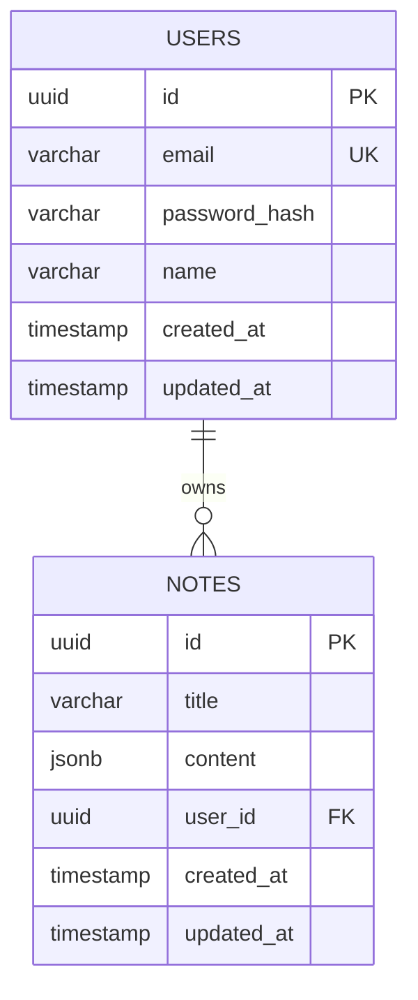

# 🏗️ FlowNote Technical Specification

> **Versiyon:** 1.0.0
> **Son Güncelleme:** 2024-12-12
> **Sahip:** @Arch

---

## 1. Teknoloji Stack'i

### Frontend
| Teknoloji | Versiyon | Açıklama |
|-----------|----------|----------|
| React | ^18.x | UI Framework |
| TypeScript | ^5.x | Type Safety |
| Vite | ^5.x | Build Tool |
| TailwindCSS | ^3.x | Styling |
| TanStack Query | ^5.x | Server State Management |
| Axios | ^1.x | HTTP Client |
| Zod | ^3.x | Client-side Validation |
| React Router | ^6.x | Routing |

### Backend
| Teknoloji | Versiyon | Açıklama |
|-----------|----------|----------|
| Node.js | ^20.x | Runtime |
| NestJS | ^10.x | Backend Framework |
| TypeScript | ^5.x | Type Safety |
| TypeORM | ^0.3.x | ORM |
| PostgreSQL | ^16.x | Database |
| Zod | ^3.x | Validation |
| Passport | ^0.7.x | Authentication |
| JWT | ^9.x | Token Management |

### DevOps
| Teknoloji | Açıklama |
|-----------|----------|
| Docker | Containerization |
| Docker Compose | Multi-container orchestration |
| GitHub Actions | CI/CD Pipeline |
| Semantic Release | Automated versioning |
| Husky | Git hooks |
| Commitlint | Commit message linting |

---

## 2. Veritabanı Şeması

### 2.1 Entity Relationship Diagram



### 2.2 Notes Table - JSONB Content Structure

> ⚠️ **KRITIK:** Notes tablosunda `content` alanı JSONB tipinde olacak ve Block dizisi tutacak.

```typescript
// Block Base Interface
interface Block {
  id: string;           // UUID
  type: BlockType;      // Discriminator
  order: number;        // Sıralama için
}

// Block Types
type BlockType = 'text' | 'heading' | 'checkbox' | 'image';

// Text Block
interface TextBlock extends Block {
  type: 'text';
  data: {
    text: string;
  };
}

// Heading Block
interface HeadingBlock extends Block {
  type: 'heading';
  data: {
    text: string;
    level: 1 | 2 | 3;  // h1, h2, h3
  };
}

// Checkbox Block
interface CheckboxBlock extends Block {
  type: 'checkbox';
  data: {
    text: string;
    checked: boolean;
  };
}

// Image Block
interface ImageBlock extends Block {
  type: 'image';
  data: {
    url: string;
    alt?: string;
    caption?: string;
  };
}

// Note Content Type
type NoteContent = (TextBlock | HeadingBlock | CheckboxBlock | ImageBlock)[];
```

### 2.3 Example JSONB Content

```json
{
  "blocks": [
    {
      "id": "block-1",
      "type": "heading",
      "order": 0,
      "data": {
        "text": "My First Note",
        "level": 1
      }
    },
    {
      "id": "block-2",
      "type": "text",
      "order": 1,
      "data": {
        "text": "This is a paragraph of text."
      }
    },
    {
      "id": "block-3",
      "type": "checkbox",
      "order": 2,
      "data": {
        "text": "Complete the project",
        "checked": false
      }
    }
  ]
}
```

---

## 3. API Contract

### 3.1 Base URL
- **Development:** `http://localhost:3000/api`
- **Production:** `https://api.flownote.dev/api`

### 3.2 Authentication Endpoints

#### POST /auth/register
```typescript
// Request
interface RegisterRequest {
  email: string;     // Zod: z.string().email()
  password: string;  // Zod: z.string().min(8)
  name: string;      // Zod: z.string().min(2)
}

// Response: 201 Created
interface AuthResponse {
  accessToken: string;
  user: {
    id: string;
    email: string;
    name: string;
  };
}
```

#### POST /auth/login
```typescript
// Request
interface LoginRequest {
  email: string;
  password: string;
}

// Response: 200 OK
interface AuthResponse {
  accessToken: string;
  user: {
    id: string;
    email: string;
    name: string;
  };
}
```

### 3.3 Notes Endpoints

> 🔒 Tüm Notes endpoint'leri JWT authentication gerektirir.

#### GET /notes
```typescript
// Response: 200 OK
interface NotesListResponse {
  notes: {
    id: string;
    title: string;
    createdAt: string;
    updatedAt: string;
    blockCount: number;  // Content'teki block sayısı
  }[];
}
```

#### GET /notes/:id
```typescript
// Response: 200 OK
interface NoteDetailResponse {
  id: string;
  title: string;
  content: NoteContent;  // Full JSONB content
  createdAt: string;
  updatedAt: string;
}
```

#### POST /notes
```typescript
// Request
interface CreateNoteRequest {
  title: string;         // Zod: z.string().min(1).max(255)
  content: NoteContent;  // Zod: Custom block array validation
}

// Response: 201 Created
interface NoteDetailResponse { ... }
```

#### PUT /notes/:id
```typescript
// Request
interface UpdateNoteRequest {
  title?: string;
  content?: NoteContent;
}

// Response: 200 OK
interface NoteDetailResponse { ... }
```

#### DELETE /notes/:id
```typescript
// Response: 204 No Content
```

---

## 4. Validation Schemas (Zod)

```typescript
// shared/schemas/block.schema.ts

import { z } from 'zod';

export const TextBlockSchema = z.object({
  id: z.string().uuid(),
  type: z.literal('text'),
  order: z.number().int().min(0),
  data: z.object({
    text: z.string(),
  }),
});

export const HeadingBlockSchema = z.object({
  id: z.string().uuid(),
  type: z.literal('heading'),
  order: z.number().int().min(0),
  data: z.object({
    text: z.string(),
    level: z.union([z.literal(1), z.literal(2), z.literal(3)]),
  }),
});

export const CheckboxBlockSchema = z.object({
  id: z.string().uuid(),
  type: z.literal('checkbox'),
  order: z.number().int().min(0),
  data: z.object({
    text: z.string(),
    checked: z.boolean(),
  }),
});

export const ImageBlockSchema = z.object({
  id: z.string().uuid(),
  type: z.literal('image'),
  order: z.number().int().min(0),
  data: z.object({
    url: z.string().url(),
    alt: z.string().optional(),
    caption: z.string().optional(),
  }),
});

export const BlockSchema = z.discriminatedUnion('type', [
  TextBlockSchema,
  HeadingBlockSchema,
  CheckboxBlockSchema,
  ImageBlockSchema,
]);

export const NoteContentSchema = z.object({
  blocks: z.array(BlockSchema),
});

export const CreateNoteSchema = z.object({
  title: z.string().min(1).max(255),
  content: NoteContentSchema,
});

export const UpdateNoteSchema = z.object({
  title: z.string().min(1).max(255).optional(),
  content: NoteContentSchema.optional(),
});
```

---

## 5. Proje Dizin Yapısı

```
flownote/
├── .ai-context/              # AI Memory System
│   ├── ROADMAP.md
│   ├── TECH_SPEC.md
│   └── ADR/                  # Architecture Decision Records
├── .github/
│   └── workflows/
│       └── ci.yml            # GitHub Actions CI/CD
├── backend/                  # NestJS Backend
│   ├── src/
│   │   ├── auth/             # Auth Module
│   │   ├── notes/            # Notes Module
│   │   ├── shared/           # Shared utilities
│   │   └── main.ts
│   ├── test/                 # E2E Tests
│   ├── Dockerfile
│   └── package.json
├── frontend/                 # React Frontend
│   ├── src/
│   │   ├── components/
│   │   ├── pages/
│   │   ├── hooks/
│   │   ├── api/
│   │   └── App.tsx
│   ├── Dockerfile
│   └── package.json
├── shared/                   # Shared Types & Schemas
│   ├── types/
│   └── schemas/
├── docker-compose.yml
├── package.json              # Root package.json (monorepo scripts)
├── .releaserc                # Semantic Release config
├── commitlint.config.js
└── README.md
```

---

## 6. Environment Variables

```env
# Database
DATABASE_HOST=localhost
DATABASE_PORT=5432
DATABASE_USER=flownote
DATABASE_PASSWORD=secret
DATABASE_NAME=flownote_db

# JWT
JWT_SECRET=your-super-secret-key
JWT_EXPIRES_IN=7d

# App
NODE_ENV=development
PORT=3000
FRONTEND_URL=http://localhost:5173
```

---

## 7. Architecture Decision Records (ADR)

| ADR # | Başlık | Durum |
|-------|--------|-------|
| ADR-001 | JSONB for Block Storage | ✅ Kabul Edildi |
| ADR-002 | Monorepo Structure | ✅ Kabul Edildi |
| ADR-003 | Zod for Validation | ✅ Kabul Edildi |

> ADR detayları `.ai-context/ADR/` klasöründe tutulacaktır.

---

## 8. Success Criteria Checklist

Her feature için aşağıdaki kriterler sağlanmalı:

- [ ] Feature branch'te geliştirildi (`feature/xxx`)
- [ ] Jest testleri yazıldı (`.spec.ts`)
- [ ] Zod validasyonu eklendi
- [ ] PR merge edildi
- [ ] GitHub Actions pipeline geçti (green)
- [ ] Otomatik Release oluştu

---

**@Arch imzası:** Bu spesifikasyon, proje boyunca referans noktası olarak kullanılacaktır.
